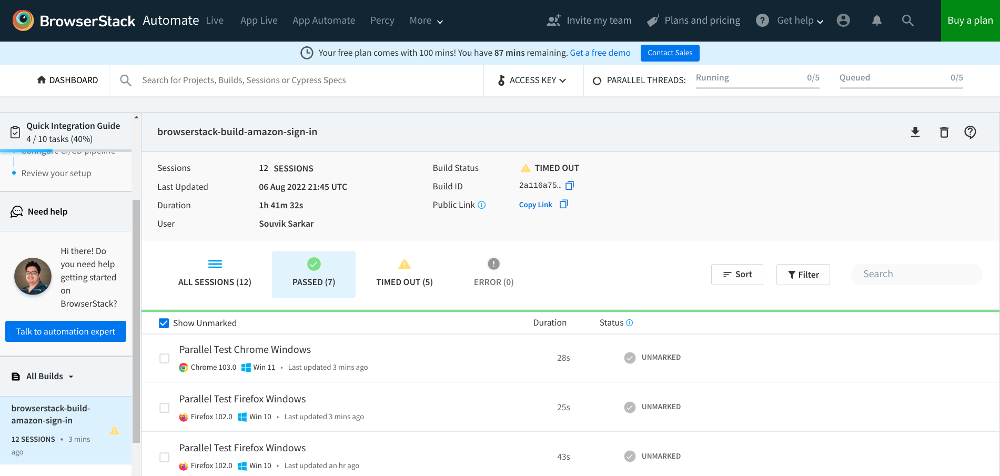
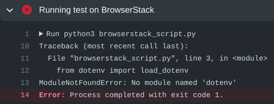

= Automated testing of **Amazon Sign in** page
Using Selenium (Python), BrowserStack, and GitHub Actions
:nofooter:
:toc: left
:toclevels: 4
:source-highlighter: highlight.js

== Overview

WORK IN PROGRESS

== Prerequisites

Before starting with test automation scripts, ensure the following:

* Git is installed in your local machine. You can download from it from the link:https://git-scm.com/downloads[git-scm website^].

* You are familiar with link:https://www.python.org/[Python^] and link:https://www.selenium.dev/[Selenium^] for automated tests.

* You have an active GitHub account. If not, link:https://github.com/signup[sign up^] for an account.

* You have a basic idea about CI/CD pipelines.

The ideal audience for this tutorial are professionals with experience in automated testing of websites and mobile applications.

== Testing on a local machine

Before running a script on BrowserStack's grid, you should create and test it on your local machine.

[NOTE]
====
All command examples and code snippets included in this tutorial have been tested on a local machine running the `Fedora 35` operating system. Whenever necessary, modify the commands and code snippets according to your machine's operating system and package manager.
====

=== Installing dependencies on the local machine

Before creating the test automation script, ensure that your local machine has all necessary dependencies.

. Sign in to your GitHub account.

. Fork the repository link:https://github.com/sounix000/browserstack-assignment[browserstack-assignment^] on GitHub.

. Clone the forked repository in your local machine. 
+
.Example: Cloning using SSH protocol
[source,terminal]
----
$ git clone git@github.com:<your_github_username>/browserstack-assignment.git
----

. Navigate to the project directory.
+
[source,terminal]
----
$ cd browserstack-assignment/
----

. Run the `set_up.sh` script file to create a virtual environment and install dependencies.
+
[source,terminal]
----
$ bash set_up.sh
----
+
For easy reference, the shell script is given below:
+
.Code
[%collapsible]
====
[,bash]
----
# This script does the following:
# - sets up a Python virtual environment in the Ubuntu runner for GitHub Actions
# - installs all prerequisites for running the `browserstack_script.py` file in the Ubuntu runner for GitHub Actions 
# the file `browserstack_script.py` on a Ubuntu runner.  
#
# You can also run this script to set up your environment and dependencies.
#
# Check out the list of preinstalled packages for Ubuntu 22.04: https://github.com/actions/virtual-environments/blob/main/images/linux/Ubuntu2204-Readme.md

# Set up and activate a Python virtual environment.
# Assumption: You have already checked out the project repository from GitHub.
cd browserstack-assignment/
python -m venv browserstack
source browserstack/bin/activate

# Install selenium v 4.1.0
python -m pip install selenium==4.1.0

# Install python-dotenv package for handling environment variables from the test script
python -m pip install python-dotenv

# Note: Because the selenium webdrivers invoke headless Chrome and Firefox in the remote BrowserStack Cloud, 
# the Ubuntu runner need not have the specific versions of Chrome and Firefox drivers as mentioned in `browserstack_script.py`.
----
====

. Check the version of Google Chrome on your machine by running `chrome://version/` on the browser's search bar. Note the version, such as `Google Chrome:	104.0.5112.79 (Official Build) (64-bit)`. 

. Check the version of any `chromedriver` package installed on your system. 
+
[source,terminal]
----
$ chromedriver --version
ChromeDriver 96.0.4664.45 (76e4c1bb2ab4671b8beba3444e61c0f17584b2fc-refs/branch-heads/4664@{#947})
----

. If the version of the `chromedriver` package is older than the Google Chrome version, remove the `chromedriver` package.
+
[source,terminal]
----
$ which chromedriver
~/bin/chromedriver

$ rm ~/bin/chromedriver
----

. Install the `chromedriver` package that matches the Google Chrome version. 
.. Download the correct version for your system from the link:https://chromedriver.chromium.org/downloads[Chromium website^].
.. Unzip the downloaded file and navigate to the resulting directory.
.. Copy the `chromedriver` binary to any location supported by your `$PATH` variable.

=== Locally running a test script 

. Create a `.env` file and save your Amazon sign in credentials in the file.
+
.Example: .env file
[source,terminal]
----
AMAZON_EMAIL="<email_registered_with_amazon>"
AMAZON_PASSWORD="<password_for_amazon_account>"
----

. Run the file `local_script.py`.
+
[source,terminal]
----
$ python local_script.py
----  

=== Understanding the local test script

The `local_script.py` Python script facilitates testing the Amazon **Sign in** page on your local machine, without involving BrowserStack. The script programmatically performs the following operations:

. Import necessary Python packages.
+
.Code
[%collapsible]
====
[,python]
----
import os, time # The function time.sleep() helps mask the scripted bot behavior.
from selenium.webdriver import Chrome
from selenium.webdriver.common.by import By
from dotenv import load_dotenv
----
====

. Define a function that mimics the human typing of username, password, and other such fields on a web page.
+
.Code
[%collapsible]
====
[,python]
----
# Helper function to mimic slow typing by a human
def slow_typing(element, text):
    for character in text: 
        element.send_keys(character)
        time.sleep(0.3)
----
====

. Define the Amazon website URL.
+
.Code
[%collapsible]
====
[,python]
----
# URL for Amazon website
# Change it depending on your location
AMZ_URL = "https://amazon.in/"
----
====

. Access the email id and password for the Amazon account used for test.
+
.Code
[%collapsible]
====
[,python]
----
# Load the environment variables from the .env file
load_dotenv()

# Read sign in credentials for Amazon from the .env file
AMAZON_EMAIL = os.environ.get("AMAZON_EMAIL")
AMAZON_PASSWORD = os.environ.get("AMAZON_PASSWORD")
----
====

. Open the Amazon sign in page in the Goggle Chrome browser.
+
.Code
[%collapsible]
====
[,python]
----
# Open browser and go to sign in page
browser = Chrome()
browser.get(AMZ_URL)
time.sleep(2)
sign_in_button = browser.find_element(By.ID, "nav-link-accountList")
sign_in_button.click()
time.sleep(2)
----
====

. Enter the sign in credentials while mimicking human interaction with the website.
+
.Code
[%collapsible]
====
[,python]
----
# Assumption: There are no two-factor authentication enabled
# Enter the sign in credentials
username_textbox = browser.find_element(By.ID, "ap_email")
slow_typing(username_textbox, AMAZON_EMAIL)
time.sleep(2)

continue_button = browser.find_element(By.ID, "continue")
continue_button.submit()
time.sleep(2)

password_textbox = browser.find_element(By.ID, "ap_password")
slow_typing(password_textbox, AMAZON_PASSWORD)
time.sleep(2)

sign_in_button = browser.find_element(By.ID, "auth-signin-button-announce")
sign_in_button.submit()
time.sleep(5)

browser.close()
----
====

For convenience, the entire script is given below:

.local_script.py
[%collapsible]
====
[,python]
----
import os, time # The function time.sleep() helps mask the scripted bot behavior.
from selenium.webdriver import Chrome
from selenium.webdriver.common.by import By
from dotenv import load_dotenv

# Helper function to mimic slow typing by a human
def slow_typing(element, text):
    for character in text: 
        element.send_keys(character)
        time.sleep(0.3)

# URL for Amazon website
# Change it depending on your location
AMZ_URL = "https://amazon.in/"

# Load the environment variables from the .env file
load_dotenv()

# Read sign in credentials for Amazon from the .env file
AMAZON_EMAIL = os.environ.get("AMAZON_EMAIL")
AMAZON_PASSWORD = os.environ.get("AMAZON_PASSWORD")

# Open browser and go to sign in page
browser = Chrome()
browser.get(AMZ_URL)
time.sleep(2)
sign_in_button = browser.find_element(By.ID, "nav-link-accountList")
sign_in_button.click()
time.sleep(2)

# Assumption: There are no two-factor authentication enabled
# Enter the sign in credentials
username_textbox = browser.find_element(By.ID, "ap_email")
slow_typing(username_textbox, AMAZON_EMAIL)
time.sleep(2)

continue_button = browser.find_element(By.ID, "continue")
continue_button.submit()
time.sleep(2)

password_textbox = browser.find_element(By.ID, "ap_password")
slow_typing(password_textbox, AMAZON_PASSWORD)
time.sleep(2)

sign_in_button = browser.find_element(By.ID, "auth-signin-button-announce")
sign_in_button.submit()
time.sleep(5)

browser.close()
----
====

== Integrating the script with BrowserStack

After successfully testing the automation script on your local machine, you can integrate the script with BrowserStack.

=== Getting BrowserStack secrets

. link:https://www.browserstack.com/users/sign_up[Sign up^] for a trial account of BrowserStack.

. Navigate to your BrowserStack link:https://automate.browserstack.com/dashboard/v2/quick-start/get-started[dashboard^].

. From the **ACCESS KEY** dropdown menu, note the values of the **User Name** and **Access Key** fields.

. In the `.env` file, add the BrowserStack secrets below the Amazon account credentials and save it.
+
[source,terminal]
----
BROWSERSTACK_USERNAME="<your_browserstack_username>"
BROWSERSTACK_ACCESS_KEY="<your_browserstack_access_key>"
----
+
The final content of the `.env` file is similar to the following:
+
[source,terminal]
----
$ cat .env

AMAZON_EMAIL="<email_registered_with_amazon>"
AMAZON_PASSWORD="<password_for_amazon_account>"
BROWSERSTACK_USERNAME="<your_browserstack_username>"
BROWSERSTACK_ACCESS_KEY="<your_browserstack_access_key>"
----

=== Modifying the test script

You must modify the script to use BrowserStack's capabilities of running parallel tests on numerous device and browser combinations.

The entire modified script named `browserstack_script.py` is given below:

.browserstack_script.py
[%collapsible]
====
[,python]
----
# Import necessary packages
import os, time
from dotenv import load_dotenv
from selenium import webdriver
from selenium.webdriver.chrome.options import Options as ChromeOptions
from selenium.webdriver.firefox.options import Options as FirefoxOptions
from selenium.webdriver.common.by import By
from threading import Thread

# Load the environment variables from the .env file
load_dotenv()

# Name of the build that will run remotely on BrowserStack
# Tests will be organized within this build
BUILD_NAME = "browserstack-build-amazon-sign-in"

# The 'capabilities' array defines various browser, device, and OS combinations for the test to run.
capabilities = [
    {
        "browserName": "chrome",
        "browserVersion": "103.0",
        "os": "Windows",
        "osVersion": "11",
        "sessionName": "Parallel Test Chrome Windows",  # test name
        "buildName": BUILD_NAME  
    },
    {
        "browserName": "firefox",
        "browserVersion": "102.0",
        "os": "Windows",
        "osVersion": "10",
        "sessionName": "Parallel Test Firefox Windows",
        "buildName": BUILD_NAME
    },
]

# Change browsers
def get_browser_option(browser):
    switcher = {
        "chrome": ChromeOptions(),
        "firefox": FirefoxOptions(),
    }
    return switcher.get(browser, ChromeOptions())

# The run_session() function handles the sign in to Amazon.
# Depending on your location, modify the default value of 
# the argument AMZ_URL.
# This function also assumes that 2-factor authentication is disabled.
def run_session(cap, AMZ_URL="https://amazon.in/"):
    cap["userName"] = os.environ.get("BROWSERSTACK_USERNAME")
    cap["accessKey"] = os.environ.get("BROWSERSTACK_ACCESS_KEY")
    options = get_browser_option(cap["browserName"].lower())
    options.set_capability("browserName", cap["browserName"].lower())
    options.set_capability("bstack:options", cap)
    driver = webdriver.Remote(
        command_executor="https://hub.browserstack.com/wd/hub", options=options
    )
    # Go to Amazon sign in page
    driver.get(AMZ_URL)
    sign_in_button = driver.find_element(By.ID, "nav-link-accountList")
    sign_in_button.click()
    time.sleep(2)
    # Access the sign in credentials
    AMAZON_EMAIL = os.environ.get("AMAZON_EMAIL")
    AMAZON_PASSWORD = os.environ.get("AMAZON_PASSWORD")
    # Enter email and continue
    username_textbox = driver.find_element(By.ID, "ap_email")
    username_textbox.send_keys(AMAZON_EMAIL)
    time.sleep(2)
    continue_button = driver.find_element(By.ID, "continue")
    continue_button.submit()
    time.sleep(2)
    # Enter password and submit
    password_textbox = driver.find_element(By.ID, "ap_password")
    password_textbox.send_keys(AMAZON_PASSWORD)
    time.sleep(2)
    sign_in_button = driver.find_element(By.ID, "auth-signin-button-announce")
    sign_in_button.submit()
    time.sleep(2)
    print("Sign in test complete.")
    driver.quit()

# The Thread() function takes run_session function and each set of capability from the caps array as an argument to run each session in parallel.
for cap in capabilities:
    Thread(target=run_session, args=(cap,)).start()
----
====

=== Observing the test results in BrowserStack dashboard

. In your BrowserStack dashboard, select the build from the **All Builds** drop down list on the left navigation pane.

. Check the status of the sessions for the selected build.
+

== Automatically running the modified script using GitHub Actions

. In your forked repository on GitHub, navigate to **Settings** -> **Secrets** (left navigation pane) -> **Actions** -> **New repository secret**.

. Add your BrowserStack secrets that are available in the `.env` file of your project directory.
.. Enter **Name**: `BROWSERSTACK_USERNAME`, **Value**: `<your_browserstack_username>`, and click **Add secret**.
.. Enter **Name**: `BROWSERSTACK_ACCESS_KEY`, **Value**: `<your_browserstack_access_key>`, and click **Add secret**.

. In the project directory, inspect the `.github/workflows/browserstack_actions.yml` file that defines the GitHub Actions workflow.
+
.Code
[%collapsible]
====
[,yml]
----
name: 'BrowserStack GH Actions Test'
on: [push, pull_request]
jobs:
  ubuntu-job:
    name: 'BrowserStack Test on Ubuntu'
    runs-on: ubuntu-latest  # Can be self-hosted runner also
    steps:

      - name: 'BrowserStack Env Setup'  # Invokes the setup-env action
        uses: browserstack/github-actions/setup-env@master
        with:
          username:  ${{ secrets.BROWSERSTACK_USERNAME }}
          access-key: ${{ secrets.BROWSERSTACK_ACCESS_KEY }}

      - name: 'BrowserStack Local Tunnel Setup'  # Invokes the setup-local action
        uses: browserstack/github-actions/setup-local@master
        with:
          local-testing: start
          local-identifier: random

      - name: 'Checkout the repository' # Uses an action from GitHub marketplace to check out the repository
        uses: actions/checkout@v2

      - name: 'Setting up the runner' # Sets up a Python virtual environment and installs prerequisites
        run: bash set_up.sh

      - name: 'Running test on BrowserStack'  # Invokes the actual test script that would run on BrowserStack browsers
        run: python3 browserstack_script.py  

      - name: 'BrowserStackLocal Stop'  # Terminating the BrowserStackLocal tunnel connection
        uses: browserstack/github-actions/setup-local@master
        with:
          local-testing: stop
----
====

. To test the GitHub Actions workflow, make a minor change in the `README.adoc` file and push the changes to GitHub.
+
[source,terminal]
----
$ git add .
$ git commit -m "Testing GitHub Actions"
$ git push origin main
----

. In your GitHub repository, navigate to **Actions** -> **<your_GitHub_Actions_job>** and observe the job logs.
+
[NOTE]
====
One of the common reasons of failure for this job is the the following error: `ModuleNotFoundError: No module named 'dotenv'`.

The failure happens due to this bug: link:https://github.com/theskumar/python-dotenv/issues/273[issue#273^].
The bug is hard to reproduce, and currently has no known solutions that are universally applicable.
====

. In your BrowserStack dashboard, select the GitHub Actions build from the **All Builds** drop down list on the left navigation pane, and observe the test status.

== Additional resources
* link:https://www.browserstack.com/guide/automate-with-selenium-python[Start Selenium Testing with Python: Automated Testing of a User Signup Form^]
* link:https://selenium-python.readthedocs.io/[Selenium with Python^]
* link:https://automate.browserstack.com/dashboard/v2/quick-start/get-started#introduction[Browserstack: Quick Integration Guide^]
* link:https://docs.github.com/en/enterprise-cloud@latest/actions[GitHub Actions^]
* link:https://www.browserstack.com/docs/automate/selenium/github-actions#set-up-github-secrets-in-your-repository[Integrate GitHub Actions with BrowserStack^]