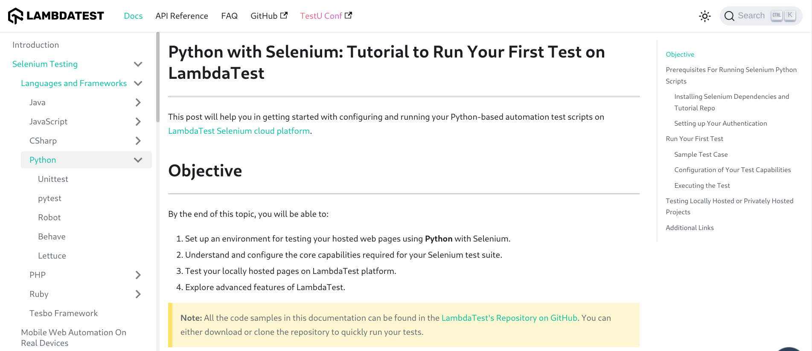

= Analysis of BrowserStack documentation
Exploring a few areas of improvement

Based on my 30 minute analysis of link:https://www.browserstack.com/docs/[BrowserStack's documentation^] and comparing with a link:https://www.lambdatest.com/support/docs/[competitor's documentation^], I don't find anything that I strongly dislike. However, as a technical writer trained to pay attention to details, I have the following **nitpicks**:

* Principles of minimalism are not followed. For example, in link:https://www.browserstack.com/docs/automate/selenium/getting-started/python#prerequisites[Getting started - Python - Prerequisites^], the first bullet point is verbose.
+
.Existing sentence
[source]
----
You need to have BrowserStack Username and Access key, which you can find in your account settings. If you have not created an account yet, you can sign up for a Free Trial or purchase a plan.
----
+
.Suggested sentence
[source]
----
Note your BrowserStack Username and Access key from the account settings. Unregistered users can sign up for a trial account or purchase a plan.
----
+
The suggestion also demonstrates restructuring of sentences to emphasize user's actions, and brings more clarity.

* Section headings are not in gerund form. For example, in link:https://www.browserstack.com/docs/automate/selenium/getting-started/python#run-your-first-test[Getting started - Python - Run your first test^]:
+
.Existing section heading
[source]
----
Run your first test 
----
+
.Suggested section heading
[source]
----
Running your first test
----
+
Gerund forms of phrases are appropriate for highlighting a process, which might contain several steps. For the steps, we can use action oriented sentences in simple present tense, such as "Create a sample test code file".

* Admonitions are misused. For example:

** The following **Warning** should ideally be a **Caution**, because the user needs to be mindful about adding the `driver.quit()` statement at the end of the code.
+

** **Protip** is not a standard admonition. Instead, use **Tip**. 
+

* Images could have been used more sparingly to avoid maintenance problems. This is even more important for images that represent products such as GitHub, which are beyond BrowserStack's control. For example, the following image represents and old layout of the GitHub Actions web page:
+
image::https://www.browserstack.com/docs/static/img/automate/selenium/github-actions/github-actions-2.png[]
+
In addition, images without appropriate `alt-text` hampers accessibility and SEO.

* Modern documentation websites adopt a three-column approach: documentation suite TOC on the left, content in the middle, and current page TOC on the right. BrowserStack's documentation website mostly leaves the right column blank. As a result, the left navigation panel looks more crowded and needs frequent scrolling.
+
.BrowserStack documentation site

+
.LambdaTest documentation site

+

* **General comment**: In lots of occasions, the writing style deviates significantly from Google's documentation style guide. In fact, a seasoned writer can easily identify the documents contributed by developers, testers, product managers, or customer support. While this is not a big problem, the documentation experience can certainly be made more consistent.

* **Bonus**: Modern test environments, especially in enterprise situations, are mostly containers running on clusters. If the onboarding docs describe procedures using containers, the onboarding experience and the documentation becomes more standardized and maintainable.

